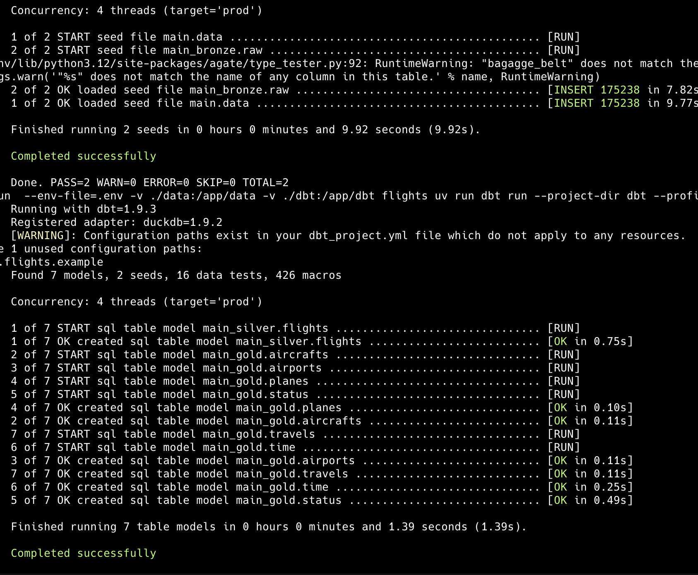
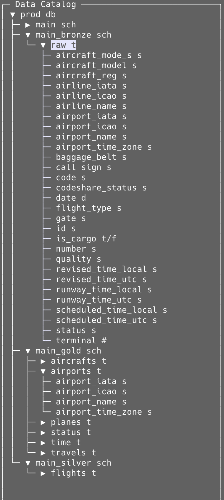
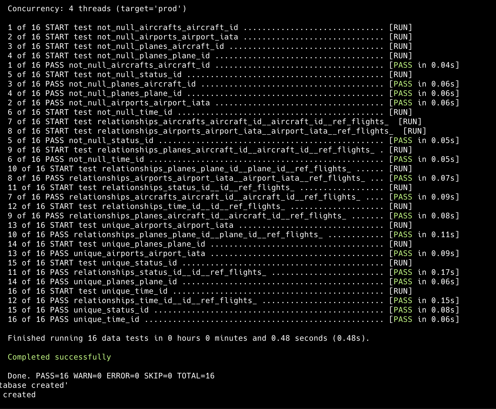
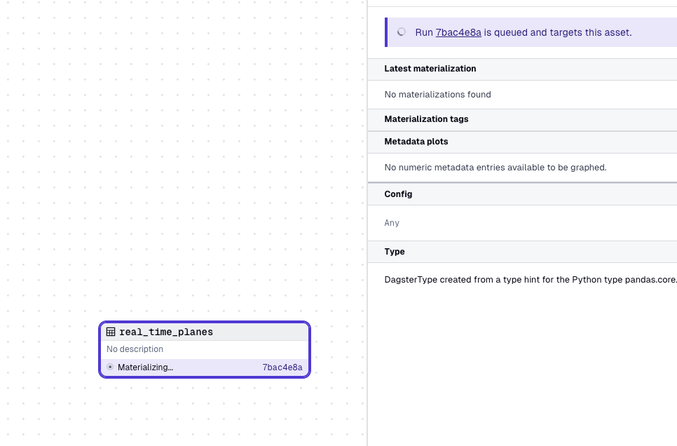
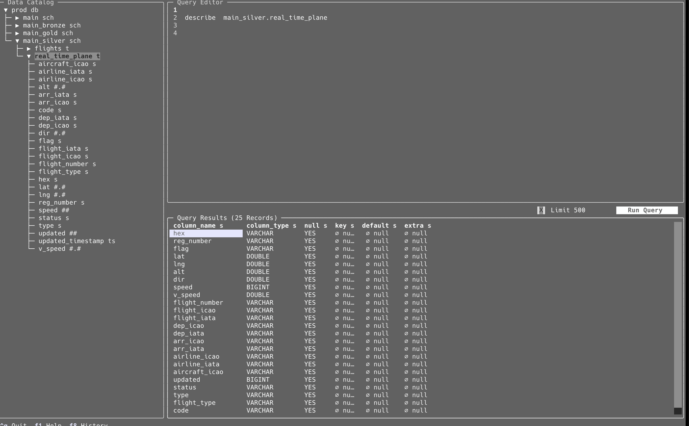
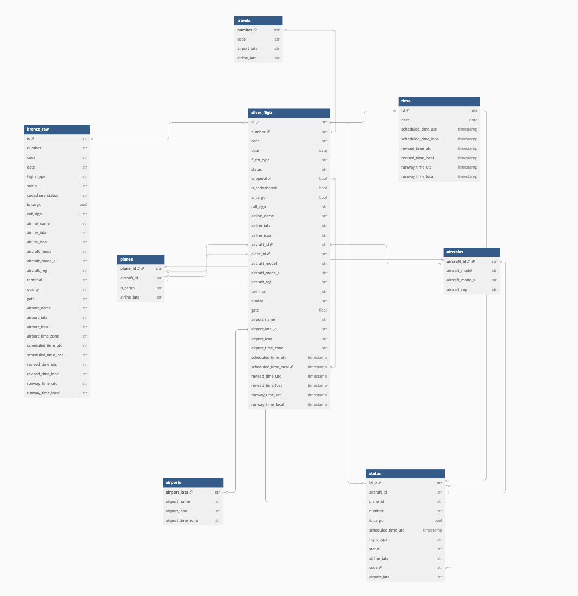

# TechTest - Simetrik

### Summary
In this project, I've implemented the three main types of data ingestion: *batch*, *delta*, and *real-time*. I used an API that provides commercial flight and transportation data [link](https://www.goflightlabs.com/), including historical and real-time data. As a result, I created three functions: one to download a range of dates ([batch](https://github.com/frandiego/tecktest-simetrik/blob/e877291689b312861a5f58338bf559d93ce1ae30/cli.py#L15)), one to update from the last downloaded date to today ([delta](https://github.com/frandiego/tecktest-simetrik/blob/e877291689b312861a5f58338bf559d93ce1ae30/cli.py#L58)), and one to download data in real-time ([real-time](https://github.com/frandiego/tecktest-simetrik/blob/e877291689b312861a5f58338bf559d93ce1ae30/flight/api.py#L191)).

Using the batch function, I downloaded data from August 2024, which is available [here](https://github.com/frandiego/tecktest-simetrik/tree/e877291689b312861a5f58338bf559d93ce1ae30/data/historical/BOG).  To understand the data flow, you can read the Makefile (described below). The process begins with building the Docker image `make build`, followed by updating the historical data `make update`. Then, all the data is joined, cleaned, and sorted `make raw-data`. Up to this point, I've used Python. Next, I employed DBT, a technology for creating a complete data architecture using only SQL and Jinja. The following steps involve removing the database `make remove_database` and creating the bronze schema `make dbt-seed`, which reads the previous CSV and creates a table with a specific schema. Once the data is in the database (I used [DuckDB](https://duckdb.org/) for simplicity), I can execute all the models in the silver and gold layers `make dbt-run`. I can control the data schema using configuration files like the one shown [here](https://github.com/frandiego/tecktest-simetrik/blob/e877291689b312861a5f58338bf559d93ce1ae30/dbt/seeds/properties.yml#L1) for seeds - raw data in csv - or we can also control the output of the models by using *contracts* like [here](https://github.com/frandiego/tecktest-simetrik/blob/e877291689b312861a5f58338bf559d93ce1ae30/dbt/models/silver/flights.yml#L1). The next step is to run unit tests `make dbt-run`, which verify that the configuration in shcema before is met. At this point, I can use external libraries like the [re-data](https://docs.getre.io/latest/docs/re_data/introduction/whatis_data/) library for data quality or the [elementary](https://www.elementary-data.com/) package for observability and version control. But I have decide to use the test provided by dbt so then we have a more structure schema registry (the yml files en the folder `dbt/models`) and by running `make dbt-test` we are tesing all the requirements set on those files. 

After the tests pass, I can view the catalog with `make docs-generate` and  `make docs-serve` or query the created database with `make sql`.

As I mentioned earlier, there's also a process for feeding data in real time. You can check out the API wrapper [here](https://github.com/frandiego/tecktest-simetrik/blob/fac07b954cf581ab7cfa17cf1fd0c77e39c84731/flight/api.py#L191) and see how it's executed in Dagster, an orchestrator, [here](https://github.com/frandiego/tecktest-simetrik/blob/fac07b954cf581ab7cfa17cf1fd0c77e39c84731/real_time_planes.py). The best part is when we see it in action, triggering an email when it feeds the table in the silver schema's `main_silver.real_time_planes`.


---

<div align="center">
  <p>While DBT Created Data Scruture</p>
  
</div>

---

<div align="center">
  <p>Data Structure Created in DBT</p>
  
</div>

---

<div align="center">
  <p>Checking the Test in DBT</p>
  
</div>

---

<div align="center">
  <p>Dagster with one only task</p>
  
</div>

---

<div align="center">
  <p>Dagster Output</p>
  
</div>

***

### Makefile description
```bash
help:           	 Show this help.
build:			 Build the docker
update:			 Updates historical data up to the current day 
raw-data:      		 Reads, cleans and transforms the data and creates the raw data
remove_database: 	 Remove existing database 
dbt-seed:  		 Upload raw.csv file to bronze schema
dbt-run: 		 Create silver and gold schemas
dbt-test: 		 Run unnit tests
database: build update raw-data remove_database dbt-seed dbt-run dbt-test   -- Run al stemps to create database
docs-generage :  	 Create docs generated by dbt to uderstand the lineage
docs-serve: 		 Display the docs
sql: 			 Create a sql-editor in terminal
orchestrator:  		 Create a the dagster orchestrator to ingest real-time data
```
so you can download the repo and run `make database` to create the database from scratch and then `make sql` to make queries.

Finally, the `infra/data-ingestion.tf` has information on how an ingestion system could be implemented in aws using AWS-SNS, AWS-Firehose and AWS-DocumentDB. This way we would have a fully functional service to send data and store it in a database. 


---

<div align="EMR of DataBase">
  <p>Dagster Output</p>
  
</div>

I a star database, in a medallion architecture, the bronze (`raw`) table can feed a cleaner and more curated version (`flithgs`) that allows generating tables such as `aircrafts`, `airports`, `planes`, `status`, `time` and `travels`.